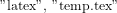

# LaTeX to Image Converter

i am to stupid to let it run, maybe later

Dieses Repository enthält ein Tool, das LaTeX-Code in Markdown-Dateien erkennt, in Bilder umwandelt und diese Bilder an den entsprechenden Stellen einfügt.

## Funktionsweise

Das Tool besteht aus einem Python-Skript und einem GitHub Action Workflow, die zusammenarbeiten, um LaTeX-Formeln in Markdown-Dateien zu finden und in Bilder umzuwandeln.

### Beispiel

Hier sind einige Beispiele für LaTeX-Formeln und deren Umwandlung in Bilder:

#### Beispiel 1: Bruch

$$
\frac{a}{b}
$$

#### Beispiel 2: Quadratische Formel

$$
x = \frac{{-b \pm \sqrt{{b^2 - 4ac}}}}{{2a}}
$$

#### Beispiel 3: Summenformel

$$
\sum_{{i=1}}^n i = \frac{{n(n+1)}}{2}
$$

#### Beispiel 4: Anti-Dump-Index (ADI)
```
$$
\text{ADI} 
= \frac{
  w_N \cdot \text{Noise} 
  \;-\;
  \Bigl(
    w_E \cdot \text{Effort} 
    + w_B \cdot \text{BonusFactors}
  \Bigr)
}{
  w_C \cdot \text{Context} 
  + w_D \cdot \text{Details} 
  + w_P \cdot \text{PenaltyFactors}
}
$$
```
```

```
## Verwendung


1. **GitHub Action Workflow**: Der Workflow wird bei jedem Push oder Pull Request ausgeführt, installiert die notwendigen Abhängigkeiten, führt das Python-Skript aus und pusht die Änderungen zurück ins Repository.
2. **Python-Skript**: Das Skript durchsucht alle `.md`-Dateien im gesamten Repository, extrahiert LaTeX-Code, wandelt ihn in Bilder um und ersetzt den LaTeX-Code durch die Bilder.

## Einrichtung

1. Erstelle eine Datei `.github/workflows/latex-to-image.yml` mit folgendem Inhalt:

    ```yaml
    name: LaTeX to Image

    on: [push, pull_request]

    jobs:
      build:
        runs-on: ubuntu-latest

        steps:
        - name: Checkout repository
          uses: actions/checkout@v2

        - name: Set up Python
          uses: actions/setup-python@v2
          with:
            python-version: '3.x'

        - name: Install dependencies
          run: |
            python -m pip install --upgrade pip
            pip install markdown2
            sudo apt-get update
            sudo apt-get install -y texlive-latex-base texlive-fonts-recommended texlive-fonts-extra texlive-latex-extra dvipng

        - name: Run LaTeX to Image script
          run: python scripts/latex_to_image.py

        - name: Commit and push changes
          run: |
            git config --global user.name 'github-actions'
            git config --global user.email 'github-actions@github.com'
            git add .
            git commit -m 'Convert LaTeX to images'
            git push
          env:
            GITHUB_TOKEN: ${{ secrets.GITHUB_TOKEN }}
    ```

2. Erstelle ein Skript `scripts/latex_to_image.py` mit folgendem Inhalt:

    ```python
    import os
    import re
    import subprocess
    from pathlib import Path

    def extract_latex_blocks(markdown_text):
        latex_blocks = re.findall(r'\$\$(.*?)\$\$', markdown_text, re.DOTALL)
        return latex_blocks

    def latex_to_image(latex_code, output_path):
        latex_document = f"""
        \\documentclass{{standalone}}
        \\usepackage{{amsmath}}
        \\begin{{document}}
        {latex_code}
        \\end{{document}}
        """
        with open("temp.tex", "w") as f:
            f.write(latex_document)

        subprocess.run(["latex", "temp.tex"])
        subprocess.run(["dvipng", "temp.dvi", "-o", output_path])

        os.remove("temp.tex")
        os.remove("temp.dvi")
        os.remove("temp.log")
        os.remove("temp.aux")

    def replace_latex_with_images(markdown_text, latex_blocks, image_paths):
        for latex, image_path in zip(latex_blocks, image_paths):
            markdown_text = markdown_text.replace(f"$${latex}$$", f"")
        return markdown_text

    def process_markdown_file(markdown_file):
        with open(markdown_file, "r", encoding="utf-8") as f:
            markdown_text = f.read()

        latex_blocks = extract_latex_blocks(markdown_text)
        image_paths = []

        for i, latex in enumerate(latex_blocks):
            image_path = f"assets/latex_{i}.png"
            latex_to_image(latex, image_path)
            image_paths.append(image_path)

        new_markdown_text = replace_latex_with_images(markdown_text, latex_blocks, image_paths)

        with open(markdown_file, "w", encoding="utf-8") as f:
            f.write(new_markdown_text)

    def main():
        for markdown_file in Path(".").rglob("*.md"):
            process_markdown_file(markdown_file)

    if __name__ == "__main__":
        main()
    ```

3. Committe und pushe die Änderungen.

## Lizenz & Danksagung

Dieses Projekt steht unter einer freien Lizenz. Sie wurde mit Hilfe von  Github Copliot erstellt 

